### 你好，我是李子龙

从前端开发走向 **AI 产品经理**，把产品思考、原型与代码连接起来。关注真实需求，也在意每一次点击的体验。

**[个人网站 ↗](https://lizilong0326.github.io/)**　 /　 [产品思考](https://www.woshipm.com/u/1686678)　 /　 [联系与关注](https://lizilong0326.github.io/#elsewhere)

## 精选作品

<table>
<tr>
<td width="50%" valign="top">

01 / macOS 效率工具

<h3><a href="https://github.com/lizilong0326/IslandMemo">IslandMemo · 丫丫灵动 ↗</a></h3>

<strong>让 Mac 顶部，成为随手可用的工作台。</strong>

把备忘录、复制记录、常用链接与专注工具放进可编排的面板，减少日常切换。按需接入 AI，将复制内容整理成待办。

<code>Swift</code> <code>macOS</code> <code>本地优先</code>

</td>
<td width="50%" valign="top">

02 / Agent 工作流

<h3><a href="https://github.com/lizilong0326/product-teardown-skill">产品拆解 Skill ↗</a></h3>

<strong>让产品分析，有证据、有结构。</strong>

基于截图、网站、源码与文档，从用户、技术、模型和数据四个层面拆解产品，生成 HTML 报告，区分事实与推断。

<code>Agent Skill</code> <code>产品研究</code> <code>证据驱动</code>

</td>
</tr>
</table>

**[03 / 个人空间 ↗](https://lizilong0326.github.io/)** — 项目、文字与日常探索的集合。浅灰像素开场，也是一次交互细节的实践。 [查看源码](https://github.com/lizilong0326/lizilong0326.github.io)

## 思考与记录

持续探索 **AI 产品实践**、**个人效率工具**，以及能复用的产品研究方法。把做过的事写下来，也把想明白的方法做成工具。

[**人人都是产品经理 · 木子李 ↗**](https://www.woshipm.com/u/1686678) 
产品思考与实践复盘。

[**微信公众号 · 木子李AI进化论 ↗**](https://lizilong0326.github.io/#elsewhere) 
长一点的思考，慢一点的记录。

扫码关注公众号

 

项目问题与建议，欢迎在对应仓库的 Issues 中交流。

---

对世界保持好奇，对值得的事保持耐心。
