# Hi, I'm Zilong 👋

从一个真实需求出发，把想法做成可以使用的工具。

我是李子龙，关注 AI 产品、macOS 效率工具与可复用的 Agent 工作流。

我做日常能用上的小工具，也把产品研究的方法整理成 Skill。希望让复杂的信息更容易理解，让重复的工作更容易完成。

🧭 [精选项目](#-精选项目) · 🧩 [产品拆解 Skill](https://github.com/lizilong0326/product-teardown-skill) · 💬 [交流与反馈](https://github.com/lizilong0326/lizilong0326/issues)

---

## ⭐ 精选项目

### 🏝️ [IslandMemo · 丫丫灵动](https://github.com/lizilong0326/IslandMemo)

把 Mac 屏幕顶部变成随手可用的本地工作台。

整合备忘录、复制记录、常用链接、录音与专注工具；按自己的习惯编排功能入口，也可以按需接入 AI 提炼任务。

`Swift` · `macOS` · `本地优先`

### 🧩 [product-teardown-skill · 产品拆解](https://github.com/lizilong0326/product-teardown-skill)

从真实证据出发，理解一个数字产品如何工作。

基于截图、网站、源码或产品文档，从用户、技术、模型与数据四个层面进行分析，生成独立 HTML 报告，并区分已确认事实、推断、建议与未知。

`Agent Skill` · `产品研究` · `HTML 报告`

---

## 🔎 我关注的方向

- **AI 产品实践**：把模型能力放进具体场景，做成可验证、可使用的功能。
- **个人效率工具**：减少日常操作，让记录、整理与执行更顺手。
- **可复用的方法**：把产品分析过程沉淀为 Skill，让研究有证据、输出有结构。

---

## About

- 📍 北京
- 🛠️ 在这里分享自己做的工具与产品研究方法
- 💬 欢迎通过项目 Issue 交流使用体验、问题和改进建议
