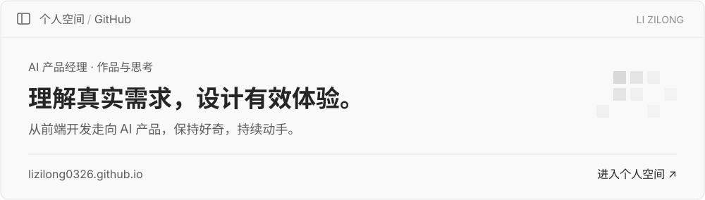

# 你好，我是李子龙

**AI 产品经理，关注用户体验与产品价值。** 曾是一名前端开发工程师，现在把产品思考、原型与代码连接起来，持续探索 AI 能解决的具体问题。

写代码的经历，让我关注界面中的每一个细节；做产品，让我开始从更前面的问题出发。

**[访问我的个人网站 ↗](https://lizilong0326.github.io/)** · [阅读产品思考](https://www.woshipm.com/u/1686678) · [联系与关注](https://lizilong0326.github.io/#elsewhere)

## 作品与实践

### [IslandMemo · 丫丫灵动](https://github.com/lizilong0326/IslandMemo)

把 Mac 屏幕顶部变成随手可用的本地工作台。将备忘录、复制记录、常用链接与专注工具放在一个可自由编排的面板里，减少日常切换；也可以按需接入 AI，将复制内容整理成待办任务。

`Swift` · `macOS` · `效率工具` · `本地优先`

### [产品拆解 Skill](https://github.com/lizilong0326/product-teardown-skill)

把产品研究的方法沉淀为可复用的 Agent 工作流。基于截图、网站、源码与文档，从用户、技术、模型和数据四个层面分析产品，输出独立 HTML 报告，并区分事实、推断、建议与未知。

`Agent Skill` · `产品研究` · `证据驱动`

### [个人空间](https://lizilong0326.github.io/)

收集做过的项目、写下的思考，以及持续探索的过程。浅灰像素开场、简洁的阅读空间，也是我对交互细节的一次实践。

[访问网站](https://lizilong0326.github.io/) · [查看源码](https://github.com/lizilong0326/lizilong0326.github.io)

## 我关注的方向

- **AI 产品实践**：从真实需求出发，关注使用场景、体验和实际价值。
- **个人效率工具**：让记录、整理与执行更顺手，减少重复操作。
- **可复用的工作方法**：把产品分析与验证过程整理成有证据、有结构的工作流。

## 文字与交流

- [人人都是产品经理 · 木子李](https://www.woshipm.com/u/1686678)：产品思考与实践复盘。
- [微信公众号 · 木子李AI进化论](https://lizilong0326.github.io/#elsewhere)：长一点的思考，慢一点的记录。
- 项目问题与建议，欢迎在对应仓库的 Issues 中交流。

微信扫码，关注「木子李AI进化论」

 

---

对世界保持好奇，对值得的事保持耐心。
