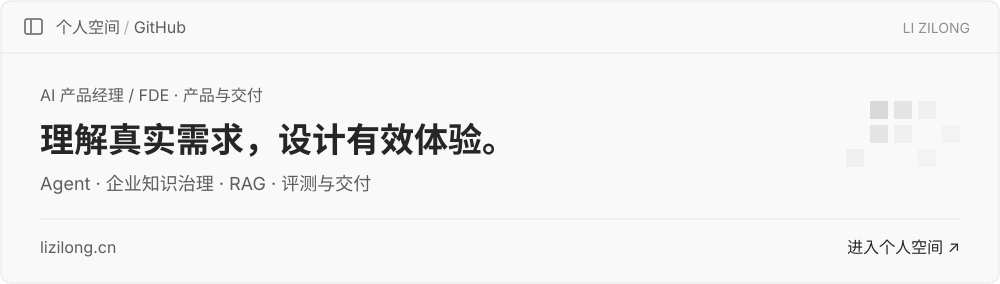

# 你好，我是李子龙

**AI 产品经理 / FDE，9 年互联网产品与技术经验，近 3 年聚焦 AI 产品设计与应用交付。** 曾任前端负责人，擅长将复杂业务流程转化为可落地的 AI 产品方案，从需求与 MVP、交互流程设计，推进到模型接入、知识治理、评测迭代和研发交付。

**[个人网站与项目详情 ↗](https://lizilong.cn/)** · [产品思考](https://www.woshipm.com/u/1686678) · [联系与关注](https://lizilong.cn/#elsewhere)

## AI 产品实践

- **3721优势科学 · AI 房车销售陪练**：主导产品方案与交互流程设计，围绕客户角色、企业知识和会话历史组织多轮训练，交付结构化评分、多模态材料处理与客户跟进辅助；负责小程序前端及联调，完善异步评分、任务补发与异常恢复。已在多品牌、多门店应用。
- **小野驴 · 房车经销商知识平台**：规划资料准入、PII 脱敏、模型抽取、人工审核、版本维护与企业权限；负责 PC／H5 前端及联调，让分散资料成为有来源、可审核、可追溯的知识资产。
- **车兄弟 · AI 预检与报价**：将证件 OCR、车辆信息识别、补贴资格规则和参考估价接入收车流程，明确 AI 辅助识别、现场核验及人工最终定价的分工，负责产品方案与前端交付。
- **21 世纪房车 · 智能客服**：负责选车咨询、用车问答与人工接手方案，协同模型接入、知识库路由、向量检索和 Rerank，交付流式会话前端。2026 年外包参与的文章 RAG 新版仍处于研发阶段。

[查看项目背景、本人职责与交付结果 →](https://lizilong.cn/#project-ai)

## 开源作品

### [译幕 Yimu · AI 字幕与配音](https://github.com/lizilong0326/yimu)

为 YouTube 视频准备简体中文字幕与中文配音，并与原视频同步播放。基于 Lumeo 二次开发，以 MIT 许可开源；采用 Node.js 本地服务与 Chrome 扩展，接入 MiniMax ASR、翻译与 TTS，通过缓存和重试组织“先生成、后播放”的处理流程。

`Node.js` · `Chrome 扩展` · `ASR / TTS`

### [丫丫灵动 IslandMemo · macOS 本地工作台](https://github.com/lizilong0326/IslandMemo)

整合任务、剪贴板、日历和 AI 状态，使用 Swift 构建。接入模型 API 提炼内容，由用户确认后保存，以 MIT 许可开源。

`Swift` · `macOS` · `本地优先`

### [丫丫状态 YaYaStatus · AI 任务进展](https://github.com/lizilong0326/YaYaStatus)

汇总多个 AI 工作台的任务进展，展示各来源连接状态，并对过期状态进行降级处理。基于 SwiftUI／AppKit 开发，已公开源码。

`SwiftUI` · `AppKit` · `任务状态`

### [产品拆解 Skill · 可复用的产品研究](https://github.com/lizilong0326/product-teardown-skill)

基于截图、网站、源码和文档，从用户、技术、模型与数据四个层面分析产品，输出独立 HTML 报告，区分事实、推断、建议与未知。

`Agent Skill` · `产品研究` · `证据驱动`

## 我如何做 AI 产品

- **方案与边界**：结合用户目标、数据条件和出错代价，明确 MVP、验收标准，以及模型、规则、人工的分工。
- **Agent 与知识**：围绕 System Prompt、上下文和工具调用组织任务；结合结构化查询、RAG、权限与审核发布，提供适用且有来源的知识。
- **评测与迭代**：建设真实任务评测集，沿意图、检索、生成和工具执行定位 Bad Case，通过同场景回放检查修复与能力退化。
- **工程与交付**：将 PRD 落实为接口约定、权限、异步状态和异常恢复；熟悉 Web、H5、微信小程序与 SSR，持续用 AI 编程工具构建原型和作品。

也参与 **未明·海龟汤** 的 AI 主持与实时协作、**一炷** 的多轮解读与 RAG 评测。[阅读协作项目实践 →](https://lizilong.cn/#project-experiment)

## 经历

- **2025.04—2026.10** · 北京小野驴科技有限公司 · AI 产品经理
- **2024.03—2025.04** · 北京车兄弟科技发展有限公司 · AI 产品经理
- **2017.07—2024.02** · 21 世纪房车 · 前端负责人

## 文字与交流

- [人人都是产品经理 · 木子李](https://www.woshipm.com/u/1686678)：产品思考与实践复盘。
- [微信公众号 · 木子李AI进化论](https://lizilong.cn/#elsewhere)：长一点的思考，慢一点的记录。
- 项目问题与建议，欢迎在对应仓库的 Issues 中交流。

微信扫码，关注「木子李AI进化论」

 

---

对世界保持好奇，对值得的事保持耐心。
